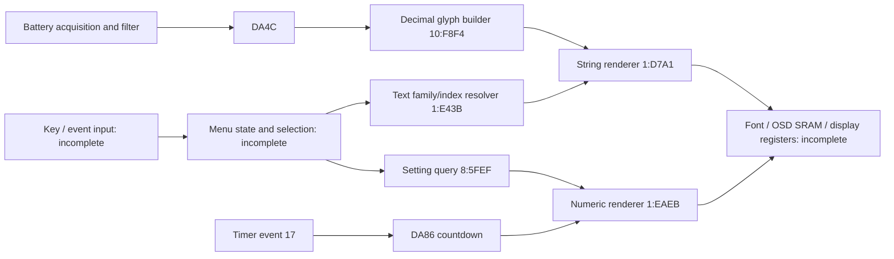

# ASUS MB16AMT V020 — OSD reverse-engineering atlas

**CONFIRMED scheduler clock reset decision:** [OSD_CLOCK.md](OSD_CLOCK.md) adds393,216 decision sweeps and300 whole static-clock calls. D83F caps its decision argument at61000 and resets/rebases only when the mathematical sum exceeds61000, including wrap. Reference scheduler identity is strong evidence; no measured physical duration. Next F73D snapshot and clock-source setup; full OSD map unfinished.

The current objective is a complete, reproducible OSD map for later modification
planning. **The complete map is not finished.** This page is the entry point;
the coverage table distinguishes reconstructed behavior from open work.
All analysis here is offline. No monitor command, patch or flash is performed.

Addresses use the repository's existing static bank model for the SHA-pinned
V020 image. A bank-local address is not automatically a validated flash patch
offset. Do not use this atlas as permission or instructions to flash an image.

## Architecture established so far



This shows proven subchains and their unresolved boundaries; it is not a
complete call graph. Menu labels, setting selectors and timer IDs are separate
namespaces and must not be equated merely because their numeric values match.

## Coverage and evidence

| Layer | Verified evidence | Remaining work |
|---|---|---|
| Bank/call ABI | Default graph158,425 starts; verified callbacks extend it to166,916 (+8,491); 52 bounded tables, 20 unresolved indirect sites | Resolve OSD-relevant indirect flow; preserve static bank-model qualification |
| Input/navigation | ADC/GPIO classifier/cache/hold verified; DD54 translation, DA6D publication/repeat timer01 and DA6C service mapped | Physical timing, button names, complete repeat flag lifecycle and menu transitions |
| Menu states | DA6B setting selector; DA0A feeds nine categories; normal/alternate command callback matrices checked | Handler labels, key transitions, modal dialogs, shortcut behavior |
| Value reads | Full 8:5FEF contract; R7 selector, R5 mode; R7 result | Tie every OSD selection to label and adjustment handler |
| Value updates | Scattered setters/DDC; hold validator, 36-byte page/FIFO/error save contract verified | Full adjustments, dirty flags and persistence for every setting; real storage completion |
| Text selection | New 1:E43B resolver map; 256 selectors × R5 values 0/1 executed | Legal family index bounds, all variants, language segment selection |
| Text encoding | Segment/font dispatch; DA03 language0..20; row56 preview/apply/save; 21 complete entry/preview/apply/exit cycles and explicit language-list segments | Modal/re-entry/high-flag variants, native/accents and complete names, wide glyph fragments/legal token bounds |
| Numeric rendering | 1:EAEB: D838..D83B input, D83C flags; known setting and countdown callers | Complete layout/format flags and hardware sink integration |
| Battery display | Source → conversion → filter → DA4C → 10:F8F4 → 1:D7A1 | Live filtered DA4C read remains unavailable; broader layout integration |
| Timer events | Exact 36-entry dispatch; 17→countdown; five leaf writers feed DA6C | Other handler meanings, producer conditions and scheduling |
| Font/icons/palette | 22 extension tables/shared FA mapped; width dispatch checked for all stored indices; cell streams to 0092 | Legal glyph bounds, resource identities/pixels, palettes, SRAM setup and coordinates |
| Windows/layout | Language group geometry, offset translation, 12-byte packing and window6 burst-register path checked with synthetic completion | Full initialization, other windows/dialogs, physical display/coordinate limits and burst timing |
| Future modifications | No patch applied | Per-resource constraints, pointers, sizes, checksums and recovery prerequisites |

Updated text layer: [OSD_TEXT_FORMAT.md](OSD_TEXT_FORMAT.md) verifies the
FF-segment traversal (36 checks) and the F8..FE prefix classifier (256 checks),
records language-dependent width/font bank dispatch, and identifies font-byte
writes at FF06. Language names, glyph bounds and complete hardware setup remain
open; the original coverage rows above describe the initial atlas baseline.

Font-output follow-up: 256 width cases, 2,340 triplet transfers and 256 loop
guard cases verify the common-font arithmetic. See
[OSD_TEXT_FORMAT.md](OSD_TEXT_FORMAT.md) and
[output contract](maps/osd-font-output.json). The EEED/F7B2 resource path is
separate from the E43B/D7A1 text path. Its resolver, FE/FD cell-stream format,
0092 drawing leaf, menu category source and language provenance are now checked
in [OSD_CELL_RENDERER.md](OSD_CELL_RENDERER.md).

Event follow-up: [OSD_EVENTS.md](OSD_EVENTS.md) connects five timer leaves to
the DA6C dispatcher at 9:B8B2, verifies every selector and its clear tail, and
identifies service caller 6:FC3E -> 9:FB97. The raw-key pipeline remains open.

Input follow-up: [OSD_INPUT.md](OSD_INPUT.md) verifies initial ADC/GPIO
classification at 2:DF25 and exhaustive current/previous input-word accesses
at DC9E..DCA1. Full sampling fixtures also cover DCA2 cache, bounded stability
retries and bit24h suppression; timing and navigation consumers remain open.

Storage follow-up: [OSD_STORAGE.md](OSD_STORAGE.md) verifies the 01D0 page planner,
0707 I2CM register frames, selected interface, bounded polling and error returns.
The 36-byte OSD parameter block reaches the prepared page payloads. EEPROM
semantics are strong evidence; real hardware completion remains open.

Command follow-up: [OSD_COMMANDS.md](OSD_COMMANDS.md) connects the input word
to DD54 translation, F9FB command publication and timer01 repeat flag.
Setting01 input branches update the DA0A category nibble; handler identity
and the complete flag lifecycle remain next.

Callback follow-up: [OSD_HANDLERS.md](OSD_HANDLERS.md) maps DA6B/DA6D pointers
through2133 and the carry-sensitive alternate guard, adding coherent handler
bodies through explicit CFG roots. Shared prelude1934 ->10:FEB0 now has an
exhaustive state-byte contract; its field consumers remain open.

Language update follow-up: [OSD_LANGUAGE_UPDATE.md](OSD_LANGUAGE_UPDATE.md)
verifies staged row56 selection, masked DA03 update, DA69 dirty flag and display
event0B. Integrated fixtures follow the event through validation and prepared
storage frames; applied DA03 occupies payload byte6. Timeout fixtures expose
clear-before-save without a carry check in BA6E. Actual persistence is unproved.
Row32 navigation and the generic setter exclusion are kept explicit.

[Language entry/layout](OSD_LANGUAGE_LAYOUT.md) adds verified target56
handoff, DA6B transition-prefix writes, the DA03-derived preview seed and
three groups of prepared selection coordinates. Full entry drawing and
final physical coordinate interpretation remain open.

The same layout checks now execute F142 through13:36BB's 12-byte packing,
control address0118, XDATA buffer01:D84E and burst-register preparation for
port0092, then rotation update01A1 and window-config clearing. All336 fixtures
use synthetic burst completion; physical display effects remain untested.

[Language-list integration](OSD_LANGUAGE_LIST.md) executes ordinary row32
entry through RET for all21 stored languages, with no drawing callee skipped.
It binds all21 list positions to explicit-index FF segments in family0E at
1:6D77; native/accents remain partial candidates rather than assigned names.
The lifecycle campaign adds21 complete preview/unchanged-apply/changed-apply/
exit cycles and131,072 bounded FA18 target-gate cases; DCC4:DCC5=02CC's
downstream meaning remains a precise open target.

[OSD notifications](OSD_NOTIFICATIONS.md) resolves that pair: GET02 returns
DCC4 status, GET52 reports DCC5 once and acknowledges it, and GETCC translates
DA03 through a21-entry protocol-code table. All reply/checksum instructions run
offline and stop before transport. This also explains the earlier ED marker
without treating it as a receive-side SET handler.

## Text family/index resolver — new verified subchain

`1:E43B` clears pointer scratch `D893..D895`, dispatches on R7 via the common
inline byte-switch helper at `210D`, builds a generic pointer and returns it in
`R3:R2:R1`. The returned register bytes match the scratch bytes in all 512
executed cases. Writes are confined to those three scratch bytes in these cases.

R5 behaves as an index for many families (**strong semantic evidence**). For
example, R7=04 returns Brightness for R5=0 and Contrast for R5=1; R7=15 gives
ON/OFF; R7=18 gives the two charge-from-PC choices. R7=30 returns the code pointer
FF:A0EF and the independently verified warning `Out of battery soon!`.

The test supplies `DCC6..DCC8=01:D837` for the dynamic text pointer. Code pointer
tag FF and RAM pointer tag 01 are different address spaces; do not treat a RAM
string as a patchable text resource. R5=0/1 coverage does not establish all legal
indices or the full ABI for dynamic cases.

- [Machine-readable atlas](maps/osd-atlas.json): all tested resolver arguments,
  returned pointers and first-segment candidates; exact timer event targets.
- [Readable first-segment index](maps/osd-resource-index.md): R5=0 view.
- [Setting query](SETTING_QUERY.md): exact value contract and callers.
- [Numeric renderer map](maps/numeric-renderer.json): historical map; its old
  CFG note for 4:F058 is superseded by the recovered timer dispatch.
- [Timer chain](DA86_TIMER.md) and [battery chain](BATTERY_PERCENTAGE.md).

The current text transcription intentionally exposes unknown glyphs as `<XX>`.
Duplicated M/W fragments are not asserted to be literal repeated letters. The
first FF-terminated segment is not the whole multilingual resource. Full bitmap
and control-code reconstruction is required before claiming exact display text.

## Reproduce

```powershell
uv run --locked --offline python tools/map_osd_atlas.py <local-V020.bin> --out docs/maps
```

The tool reuses the existing bank decoder and bounded 8051 interpreter, checks
the firmware hash, refuses unknown instructions/budget overruns, asserts the
warning fixture and timer target, and exports derived metadata only. Neither
firmware bytes nor font bitmaps are published.

## Next precise targets

1. Recover resolver family bounds, legal glyph bounds and language
   adjustment/persistence; stored validation, segment traversal and common-font
   output are already checked.
2. Complete E6B6/E20F input consumption, the delay clock/timer,
   repeat and menu transitions to these label families.
3. Connect each setting to read/update/persistence and renderer coordinates.
4. Finish hardware font/map/palette writes, then describe modification points
   with explicit unresolved constraints. No flashing belongs to this mission.
