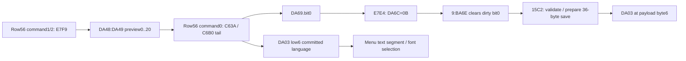

# Language preview, apply writer and display-event provenance

The extended [callback matrix](OSD_HANDLERS.md) separates the ordinary language
menu row **32** from its staged selection row **56**. These are DA6B setting
selectors, not language IDs. Language IDs remain numeric 0..20; their human
names are not yet mapped. All evidence is offline on the pinned V020 image.

## Confirmed preview and apply roots

| DA6B row56 command | Callback | Checked behavior |
|---|---|---|
| 0 | 9:C63A | Compare stored language against staged DA48:DA49; later C6B0 reads staged DA49 and updates DA03 |
| 1 | 9:E7F9 | Advance staged index, wrapping 20 to0 |
| 2 | 9:FEEB -> E7F9 | Decrease staged index, wrapping0 to20 |
| 3 | 9:FA18 | Separate transition callback; full effects remain open |

E7F9 calls A99C to read BE16 DA48:DA49, initializes lower bound D827:D828=0,
then calls `19D6 -> 8:B9A9` with upper20 and step1. Its setting56 branch
calculates the command-dependent result. A8D4 stores that result to
DA54:DA55; E821..E82B copies it into DA48:DA49. Execution stops before
`E831 -> 19DC -> 10:CA2A` refresh effects.

**10,752 fixtures** cover every staged index0..20, both preview callbacks and
every packed stored-language byte. Command1 gives `(staged+1)%21`, command2
`(staged-1)%21`; DA03 and DA69 stay unchanged at this boundary. The staged
selection is therefore distinct from the committed language.

## Confirmed committed-byte writer

C63A queries selector32 through the verified getter8:5FEF. With DA48=0,
equal staged/current low-six-bit values return via C743. All 64x64 pairs
are checked up to the changed-value boundary C652, before drawing side effects.

The later coherent tail **9:C6B0..C6C2** reads DA49, masks it with3F, and
updates DA03 as `(old&C0)|(DA49&3F)`. Helper **A93F** performs the write at
the supplied DPTR, then sets **DA69.bit0**, preserving other flags. These
contracts pass all65,536 old/staged byte pairs and256 dirty-flag cases.
The writer does not clamp to20; valid preview bounds and the separately
verified storage validator are distinct constraints.

The next call **167C -> 8:E7E4** writes **DA6C=0B** if DA69 is nonzero,
preserving DA69; zero DA69 leaves DA6C unchanged. All256 flag bytes with both
incoming carry values pass. The existing display-event dispatcher sends
0B to **9:BA6E**. That handler clears DA69.bit0 **before** calling
`15C2 -> 8:DDB3`, the verified validator and 36-byte parameter save path.

**672 integrated fixtures** execute C6B0 through E7E4, then the actual pending
event dispatcher, validator, page writer and polling instructions with
synthetic FF5D success status. Coverage is all21 language indices, four DA03
high-bit combinations, both DA87.bit3 states and four profiles. Concatenating
the prepared page payloads reproduces D9FD..DA20; **byte6 is the applied DA03**.
The five logical save slots retain the previously verified page boundaries.
BAE1 clears DA6C after dispatch. This is prepared-transfer provenance, not
evidence that a real storage device accepted or persisted the bytes.

Three actual timeout fixtures (initial readiness, transfer completion and
polling) still leave DA69.bit0=0 and DA6C=0, with the changed DA03 in RAM.
BA6E does not test the carry returned by 15C2 and issues no retry within this
handler. Retries elsewhere and real medium state remain unproved.

All256 dirty-flag inputs also verify BA6E's dispatch order: clear bit0 then
call15C2; bit2/15EC; bit3/19BE; bit5/15F2; bit1/15E6. Bits4/6/7 are retained
by this handler itself. These latter checks explicitly model leaf calls out;
only the language bit0 save path has integrated leaf execution here.



The diagram composes checked subcontracts. Integrated save fixtures start at
the writer tail, excluding drawing between C63A's comparison and that tail;
preview fixtures stop before their refresh call. No real display, storage write
or command occurs.

## Why the generic numeric route is excluded for row32

The normal row32 command1/2 callbacks FD9D/FE7F call C031 **only when
DA68.bit6 is clear**, otherwise return (512 cases). C031 tests the same flag
and then selects its navigation branch C049. Thus those callbacks do not
establish a row32 path through C0E6's numeric adjustment branch.

Separately, **8:8B52 with selector32** does not update DA03: all65,536 packed
language/proposed-byte cases write only scratch D824=32. Language modification
must be followed through row56 staging/application rather than inferred from
the presence of a language query in the generic getter. This resolves the
previous next-target assumption without changing the verified getter contract.

## Reproduce and remaining work

```powershell
uv run --locked --offline python tools/map_osd_language_update.py <local-V020.bin> --out docs/maps/osd-language-update.json
```

[Derived checks](maps/osd-language-update.json) publish no resource bytes.
[Entry/layout follow-up](OSD_LANGUAGE_LAYOUT.md) checks the row32-to56 caller,
DA6B transition prefix, staged-value seed and CD7E refresh geometry with explicit
drawing boundaries, then executes window packing/register preparation with
synthetic burst completion. [List/lifecycle integration](OSD_LANGUAGE_LIST.md)
now executes ordinary entry, preview, apply and exit for all21 indices.
Next precise targets: **DCC4:DCC5=02CC consumers**, transition variants and the
other **9:BA6E** dirty-flag leaves. Native/accents still require glyph evidence.
Physical button labels, storage completion and the complete OSD map remain open.
